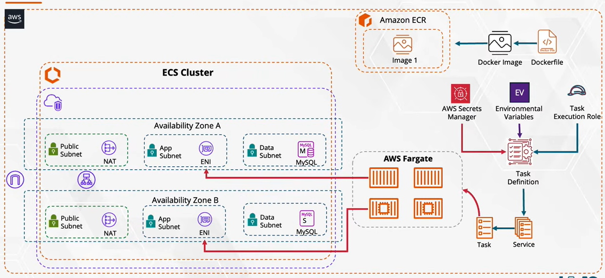

# ☕ Coffee Shop Website — AWS Fargate Deployment

A simple front-end coffee shop website, containerized with Docker and deployed on **AWS ECS Fargate** across multiple Availability Zones for high availability.

> **Note:** This is a learning/mini project. AWS resources were torn down after testing to avoid ongoing costs, so no live demo link is provided.

---

## 📐 Architecture



## 🛠️ Prerequisites

* **AWS Account** with administrative permissions.
* **AWS CLI** installed and configured (`aws configure`).
* **Docker Engine** / Docker Desktop running locally.
---

## 📌 Notes

- This project was built primarily to practice deploying containerized apps on **ECS Fargate** with a proper Multi-AZ VPC setup.
- Documentation (this README + architecture diagram) is the primary deliverable, since the live environment is no longer running.

---

## 🚀 Step-by-Step Guide

### Step 1: Provision Network Infrastructure
1. Create a custom **Amazon VPC**.
2. Create **2 Public Subnets** (across different AZs) and **2 Private Subnets**.
3. Attach an **Internet Gateway (IGW)** to the VPC and configure route tables for public routing.
   #### structure of the vpc:
   


---

### Step 2: Configure Security Groups
1. **ALB Security Group:**
   * **Inbound:** HTTP (Port `80`).
2. **app-sg:**
   * **Inbound:** HTTP (Port `80`).
3. **data-sg:**
   * **Inbound:** MySQL/Aurora (Port `3306`), source-> app-sg

---

### Step 3: Containerize Application & Push to ECR
1. Make ECR repository:
2. Build DOcker image & push to ECR repo with terminal commands:
   ```bash
      docker tag coffee-website:latest <my acc ID>.dkr.ecr.eu-north-1.amazonaws.com/coffee-website:latest
      docker push <my acc ID>.dkr.ecr.eu-north-1.amazonaws.com/coffee-website:latest
   ```


### Step 4: Create DB with RDS
1. **DB Subnet Group:** Create a DB Subnet Group selecting the two private data subnets created in Step 1 across different Availability Zones.
2. **Database Instance:** 
   * Launch an **Amazon RDS MySQL** instance using the standard tier or Free Tier options.
   * Attach the `data-sg` security group to allow inbound traffic on port `3306` exclusively from `app-sg`.
   * Configure the database credentials, default database name, and initial settings required by your application.

---

### Step 5: Configure Application Load Balancer & Target Group
1. **Target Group Creation:**
   * Create a Target Group with target type set to **IP addresses** (required for ECS Fargate `awsvpc` network mode).
   * Set protocol to **HTTP** and port to `80`.
   * Configure health checks pointing to your application's index route (`/`).
2. **Application Load Balancer (ALB) Setup:**
   * Create an Internet-facing Application Load Balancer inside your VPC.
   * Select the **2 Public Subnets** across different Availability Zones for high availability.
   * Attach the `ALB Security Group` (`alb-sg`).
   * Add a listener on HTTP port `80` that forwards incoming traffic to the Target Group created above.

---

### Step 6: Create ECS Cluster & Task Definition
1. **ECS Cluster:**
   * Create a new Amazon ECS Cluster choosing the **AWS Fargate (serverless)** infrastructure type.
2. **Task Definition:**
   * Register a new Task Definition with launch type set to **FARGATE**.
   * Specify CPU and Memory allocations based on application needs (e.g., 0.5 vCPU, 1 GB RAM).
   * Ensure the **Task Execution Role** (`ecsTaskExecutionRole`) has permissions to pull images from Amazon ECR and publish logs to Amazon CloudWatch.
   * Add a container specification:
     * **Image URI:** `<my acc ID>.dkr.ecr.eu-north-1.amazonaws.com/coffee-website:latest`
     * **Port Mapping:** Map container port `80` (HTTP).
     * **Environment Variables:** Pass database connection details (DB Host/Endpoint, DB Name, DB User, DB Password) if required by the application.

---

### Step 7: Deploy ECS Fargate Service
1. Create an **ECS Service** under your cluster:
   * Select your Task Definition and desired number of tasks (e.g., `2` tasks for high availability across AZs).
   * **Networking Configuration:** Select your VPC and assign the **2 Private Subnets**.
   * Attach the `app-sg` security group to the tasks.
   * Enable **Auto-assign Public IP** as `DISABLED` so tasks run securely in private subnets.
2. **Load Balancer Integration:**
   * Link the service to the Application Load Balancer and select the existing Target Group.
   * Map the container port `80` to the ALB target group.

---

### Step 8: Verification & Testing
1. Navigate to the **EC2 Load Balancers** dashboard and select your Application Load Balancer.
2. Copy the **DNS Name** of the ALB.
3. Paste the DNS endpoint into your browser to verify that the Coffee Shop website loads correctly and connects to the database.

---

## 🧹 Resource Teardown & Cleanup

To avoid ongoing charges on AWS, all resources were torn down in the following order:

1. **ECS Service & Cluster:** Scaled down service tasks to `0`, deleted the ECS Service, and deleted the ECS Cluster.
2. **Task Definitions & ECR:** Deregistered Task Definitions and deleted images/repositories in Amazon ECR.
3. **Application Load Balancer:** Deleted the ALB and Target Group.
4. **RDS Instance:** Deleted the MySQL RDS database instance and snapshot (if applicable), followed by the DB Subnet Group.
5. **VPC Infrastructure:** Deleted Internet Gateways, NAT Gateways (if applicable), Route Tables, Subnets, Security Groups, and the custom VPC.


